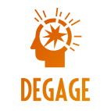
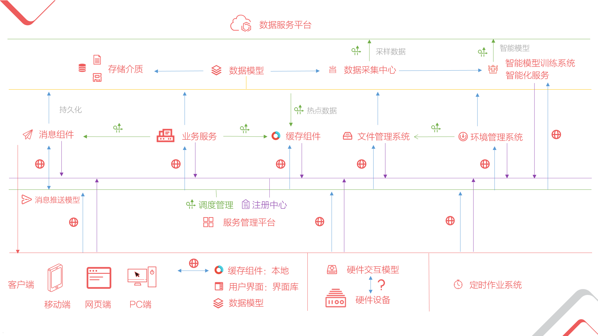
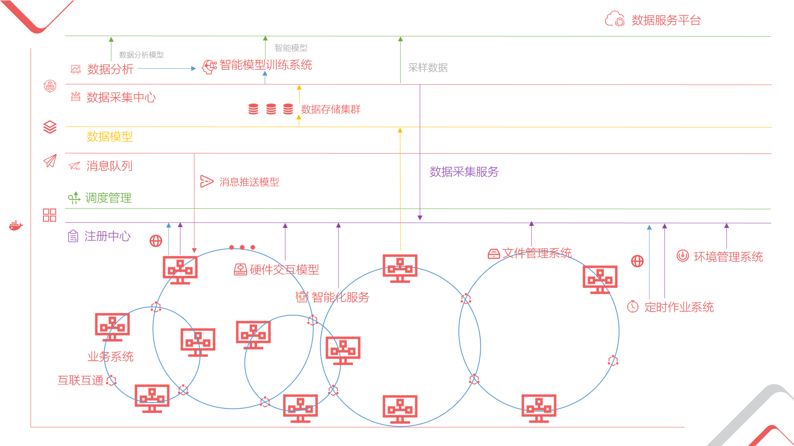
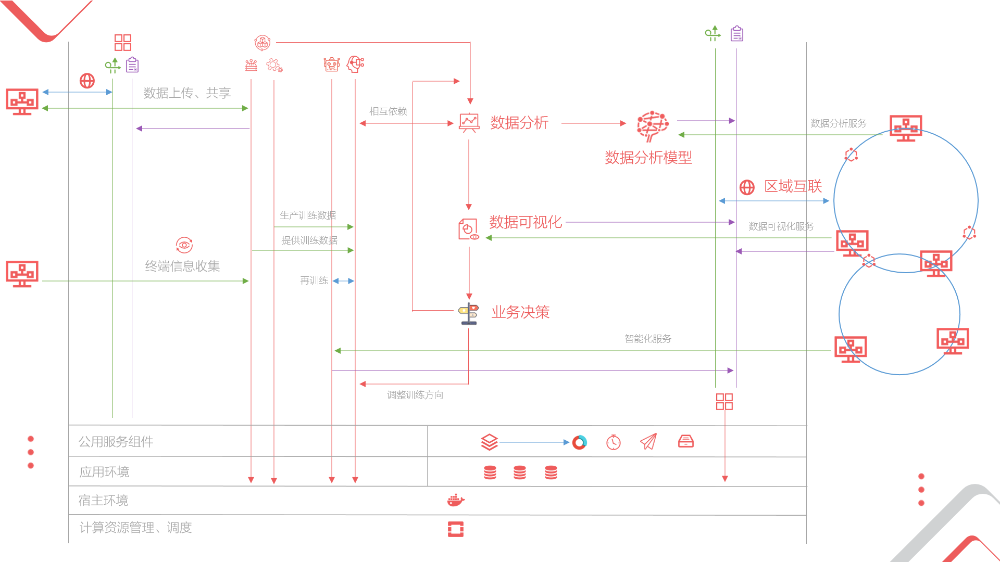

Hi，Every one 。

<h1 align="center">DEGAGE 开发平台</h1>

<h2>
前言
</h2>
 DEGAGE 是一个为软件开发整个生命周期中提供各种各样工具与一系列分布式组件与技术方案的平台，我们希望无论在开发生命周期中从事何种工作的人，都可以享受到平台带来的便利，并为公司或个人带来统一快速的开发框架以及经验积累的容器。  

 为不同的人员我们提供不同的辅助。
 * 为开发人员：我们提供丰富的基础类库、覆盖各个平台UI组件、多样化的服务组件、与 Visual Studio 紧密集成的协作工具、快速寻错调式工具、用于快速成型的开发框架。  
 * 为实施/维护人员：我们提供自动化部署工具，从云到客户的主机，你可以快速的迭代产品，监控各个终端，通过平台在线收集客户的需求，另外我们可以收集您多年的维护经验，并以此为您构建得心应手的工具，您可以在线/离线使用它们。
 * 为项目经理：平台拥有灵活 **功能组件** 模型，所有按照规范开发的功能组件都可以重复利用并协同工作，您可以最大程度上利用其他产品已有功能组件，结合平台提供的基础框架，快速构建出符合客户要求的全新产品。
 * 为..
 * 为所有人：
   * 提供完善的知识库系统，分享与记录您的经验。
   * 模板系统，您可以从此处获取或构建各类图标、在线编写不同的产品文档、各类规范文档，我们尽可以减少您在创造之外的工作，并为您提供高质量的基础模板，当然，各类产品的界面模板也是必不可少的。总之，您可以在此处获取别人的灵感，分享自己的并使之成为模板中的一份。
   * ...
***

此 repo 着重描述平台的整体设计以及组件概要设计、组件之间的关系、如何协同运作，而具体每个组件的实现原理以及详细设计、代码，请前往相应 repo。 😄😄

~~

*链接一下个人博客*

您可以访问：[http://degagetech.github.io](http://degagetech.github.io/) 😚  
国内用户也可以访问:[http://blog.degage.tech](http://blog.degage.tech/) 😙

------

### 平台组件大纲

***图示***

***目录***

*（注：目录旁有 📕 字样的符号，表示我们已经开始为其编写文档。）*

- [基础组件](#基础组件)
     - [基础类库](#基础类库)
     - [数据模型](#数据模型)  [📕](https://github.com/degagetech/degage-platform-data-model "查看对于此组件的详细描述")
         - [数据描述](#数据描述)
         - [数据访问](#数据访问)
           - [数据库](#数据库)
           - [内存](#内存)
           - [文件](#文件)
         - [数据日志](#数据日志)
           - [数据变动记录](#数据变动)
           - [数据回退](#数据回退)
     - [服务模型](#服务模型)  [📕](https://github.com/degagetech/degage-platform-service-model "查看对于此组件的详细描述")
         - [服务描述](#服务描述)
         - [远程调用](#远程调用)
         - [服务注册与发现](#服务注册与发现)
         - [服务一致性模型](#服务一致性模型)
- [功能组件模型](#功能组件平台)
     - [功能组件模型](#功能组件模型)
         - [组件规范](#组件规范)
         - [协同运作](#协同运作)
      - [功能组件管理系统](#功能组件管理系统)
- [文件管理系统](#文件管理系统) [📕](https://github.com/degagetech/degage-platform-file-system "查看对于此组件的详细描述")
- [消息组件](#消息组件)
     - [消息队列](#消息队列)
     - [消息推送模型](#消息推送模型)
- [缓存组件](#缓存组件)
     - [数据一致性模型](#数据一致性模型)
- [服务管理平台](#服务管理平台)
     - [注册中心](#注册中心)
     - [调度管理](#调度管理)
     - [互联互通](#互联互通)
- [定时作业系统](#定时作业系统)
- [知识库系统](#知识库系统)
- [模板系统](#模板系统)
- [环境管理系统](#环境管理系统)
     - [系统部署](#系统部署)
        - [自动化管理](#自动化管理)
        - [Docker部署方案](#Docker部署方案)
     - [版本控制](#版本控制)
     - [终端信息收集](#终端信息收集)
- [硬件集成平台](#硬件集成平台)
     - [交互模型](#交互模型)
     - [硬件SDK库](#硬件SDK库)
     - [交互模拟器](#交互模拟器)
- [用户界面](#用户界面)
     - [界面设计指南](#界面设计指南)
     - [界面模型](#界面模型)
     - [界面库](#界面库)
- [智能化技术平台](#智能化技术平台)
     - [图像处理与分析](#图像处理与分析)
        - [文字识别模型](#文字识别模型)
        - [图像识别模型](#图像识别模型)
     - [自然语言处理](#自然语言处理)
        - [信息结构化](#信息结构化)
     - [智能模型训练系统](#智能模型训练系统)
- [数据集成平台](#数据集成平台)
     - [数据采集中心](#数据采集中心)
     - [数据分析](#数据分析)
     - [数据可视化系统](#数据可视化系统)
     - [数据生产系统](#数据生产系统)
         - [数据模拟](#数据模拟)
         - [数据重组](#数据重组)
- [私有云平台构建方案](#私有云平台构建方案)
     - [Open Stack构建](#OpenStack)
- [高可用性技术方案](#高可用性技术方案)
     - [数据库集群构建](#数据库集群)
        - [MariaDb](#MariaDb)
        - [PostgreSQL](#PostgreSQL)
        - [Redis](#Redis)

------

### 工具箱

每个组件都会包含有自己的工具集，当然还有属于组件之外的小工具，它们旨在减少您重复枯燥的工作、并为您带来乐趣😄，我们正逐步将它们整理出来，并会持续更新，您可以在 [此处](https://github.com/degagetech/degage-platform-toolbox) 查看。

### 平台组件在实际中的应用交互示例

（请您参照大纲图示中信息阅读）

#### 1. 单业务系统

#### 2. 多业务系统协同

#### 3.数据服务

****
若有兴趣加入我们一起完善此平台，您可以通过TIM扫描下面的二维码，并备注您最得意的开源项目地址。

