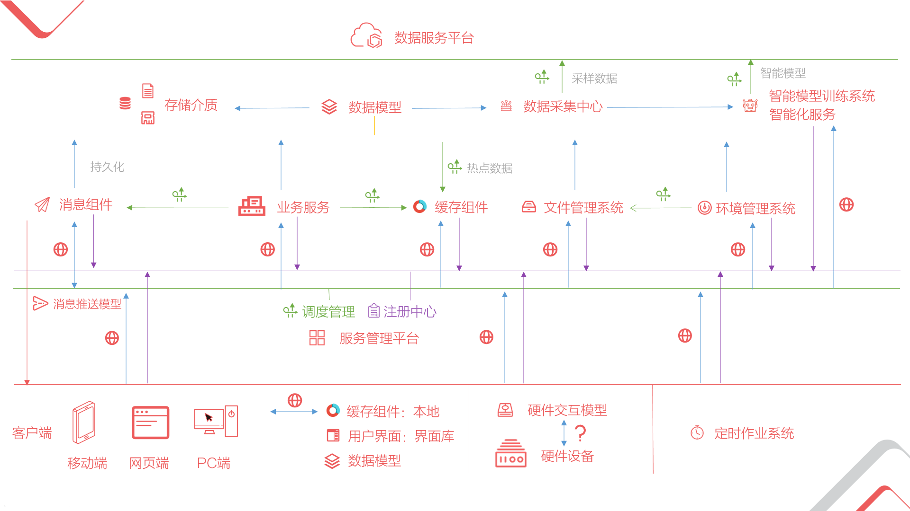
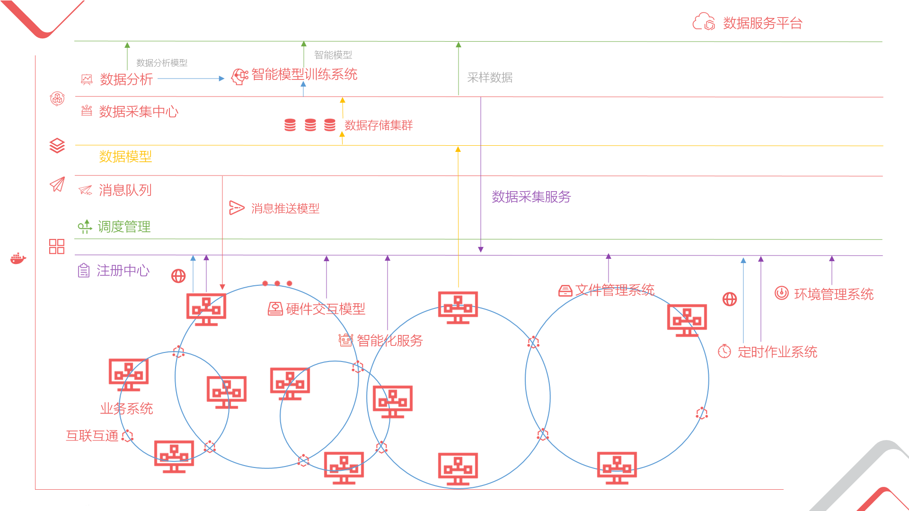
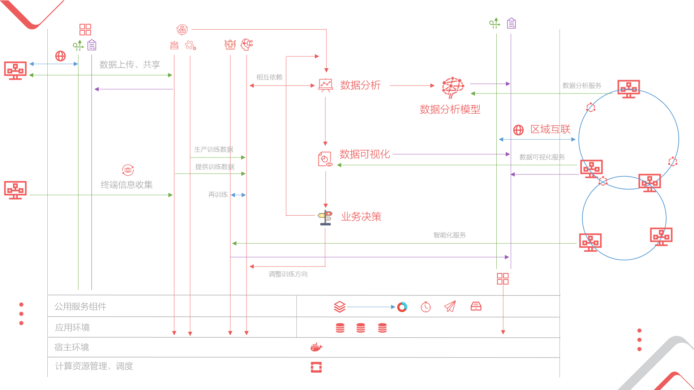

Not yet completed !!!

<h1 align="center"><i>DEGAGE</i> Development Platform</h1>

<h2>
INTRODUCTION
</h2>
Degage is a platform for the development of all kinds of tools and a series of distributed components and technical solutions for software development throughout the lifecycle, and we hope that no one who works in the development lifecycle can enjoy the convenience of the platform, and bring a unified and rapid development framework for the company or individual, and the container that the experience accumulates.  

 * For developers: We offer a rich base class library, UI components covering various platforms, diverse service components, collaboration tools that are tightly integrated with Visual Studio, fast error-tolerant tools, and a development framework for rapid prototyping.
 * For implementation/maintenance staff: We provide automated deployment tools, from cloud to customer host, you can iterate products quickly, monitor individual terminals, collect customer needs online through the platform, and we can integrate your years of maintenance experience to make it Become a handy tool and use them online/offline.
 * For the project manager: the platform has flexible ** functional components** mechanism, all the functions developed according to the specifications can work together, you can make the best use of the existing functions of other products, combined with the basic framework provided by the platform, quickly build a match A new product requested by the customer.
 * For..
 * For everyone：
   * Provide a comprehensive knowledge base system to share and record your experience.
   * Template system, you can get or build various icons from here, write different product documents and various specifications documents online, we can reduce your work outside of creation, and provide you with high-quality basic templates, of course. Interface templates for various products are also essential. In short, you can get inspiration from others here, share your own and make it a part of the template.
   * ...
***

### Platform Component Outline

***Image***

***Catalog***  

- [基础组件](#基础组件)
     - [基础类库](#基础类库)
     - [数据模型](#数据模型) （10%）[📃](data-model/DATAMODEL.md "查看对于此章的详细描述")
         - [数据描述](#数据描述)
         - [数据访问](#数据访问)
           - [数据库](#数据库)
           - [内存](#内存)
           - [文件](#文件)
         - [数据日志](#数据日志)
           - [数据变动记录](#数据变动)
           - [数据回退](#数据回退)
     - [服务模型](#服务模型)
         - [服务描述](#服务描述)
         - [服务发现](#服务发现)
         - [远程调用](#远程调用)
         - [服务一致性模型](#服务一致性模型)
- [功能组件模型](#功能组件平台)
     - [功能组件模型](#功能组件模型)
         - [组件规范](#组件规范)
         - [协同运作](#协同运作)
      - [功能组件管理系统](#功能组件管理系统)
- [文件管理系统](#文件管理系统)
- [消息组件](#消息组件)
     - [消息队列](#消息队列)
     - [消息推送模型](#消息推送模型)
- [缓存组件](#缓存组件)
     - [数据一致性模型](#数据一致性模型)
- [服务管理平台](#服务管理平台)
     - [注册中心](#注册中心)
     - [调度管理](#调度管理)
     - [互联互通](#互联互通)
- [定时作业系统](#定时作业系统)
- [知识库系统](#知识库系统)
- [模板系统](#模板系统)
- [环境管理系统](#环境管理系统)
     - [系统部署](#系统部署)
        - [自动化管理](#自动化管理)
        - [Docker部署方案](#Docker部署方案)
     - [版本控制](#版本控制)
     - [终端信息收集](#终端信息收集)
- [硬件集成平台](#硬件集成平台)
     - [交互模型](#交互模型)
     - [硬件SDK库](#硬件SDK库)
     - [交互模拟器](#交互模拟器)
- [用户界面](#用户界面)
     - [界面设计指南](#界面设计指南)
     - [界面模型](#界面模型)
     - [界面库](#界面库)
- [智能化技术平台](#智能化技术平台)
     - [图像处理与分析](#图像处理与分析)
        - [文字识别模型](#文字识别模型)
        - [图像识别模型](#图像识别模型)
     - [自然语言处理](#自然语言处理)
        - [信息结构化](#信息结构化)
     - [智能模型训练系统](#智能模型训练系统)
- [数据集成平台](#数据集成平台)
     - [数据采集中心](#数据采集中心)
     - [数据分析](#数据分析)
     - [数据可视化系统](#数据可视化系统)
     - [数据生产系统](#数据生产系统)
         - [数据模拟](#数据模拟)
         - [数据重组](#数据重组)
- [私有云平台构建方案](#私有云平台构建方案)
     - [Open Stack构建](#OpenStack)
- [高可用性技术方案](#高可用性技术方案)
     - [数据库集群构建](#数据库集群)
        - [MariaDb](#MariaDb)
        - [PostgreSQL](#PostgreSQL)
        - [Redis](#Redis)
 
### Examples of application interactions between platform components in practice
（Please refer to the outline for image）

#### 1. Single Service System

#### 2. Multi-service System Collaboration

#### 3.Data Services

**** 
If you are interested in joining us to improve the platform, you can scan the qr code below through TIM and note the address of your open source project.

